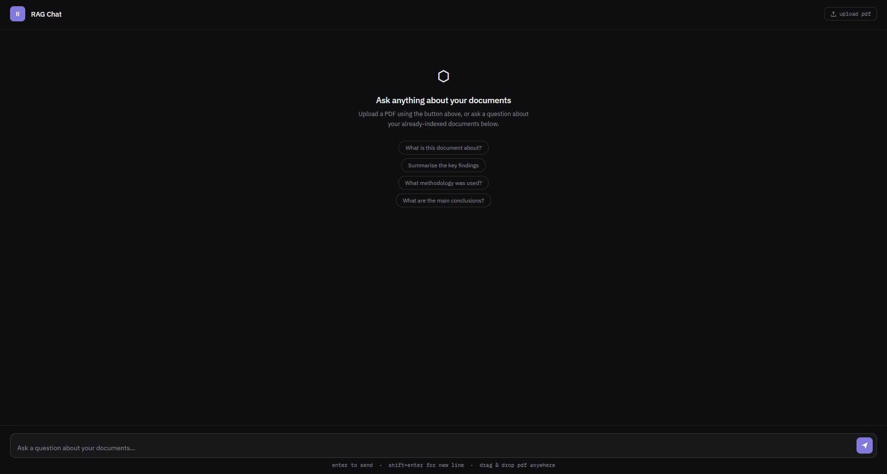

# RAG Chat — Document Intelligence

A full-stack Retrieval-Augmented Generation (RAG) application that lets you upload PDF documents and query them through a custom chat interface. Built with LangChain, Pinecone, Groq, and FastAPI.



---

## What it does

Large language models only know what they were trained on. RAG Chat solves this by letting you upload your own documents and ask questions about them in plain English — the app finds the most relevant sections and uses an LLM to generate an accurate, grounded answer.

- Upload any PDF via button click or drag and drop
- Documents are automatically chunked, embedded, and stored in a vector database
- Ask questions in a ChatGPT-style interface
- Answers are generated using only the content of your documents

---

## Tech Stack

| Component | Technology | Purpose |
|-----------|-----------|---------|
| Orchestration | LangChain | Chains together retrieval and LLM calls |
| Vector Database | Pinecone | Stores and searches document embeddings |
| Embeddings | HuggingFace (all-MiniLM-L6-v2) | Converts text chunks to vectors locally |
| LLM | Groq (Llama 3.1) | Generates answers from retrieved context |
| Backend | FastAPI | REST API serving the /ask and /upload endpoints |
| Frontend | Vanilla HTML/CSS/JS | Custom chat interface, no framework needed |

---

## How it works

1. **Ingestion** — uploaded PDFs are loaded and split into overlapping chunks of ~800 characters using `RecursiveCharacterTextSplitter`
2. **Embedding** — each chunk is converted into a 384-dimension vector using the MiniLM model running locally
3. **Storage** — vectors and their source text are stored in a Pinecone serverless index using cosine similarity
4. **Retrieval** — when a question is asked, it is embedded using the same model and the top 3 most similar chunks are retrieved from Pinecone
5. **Generation** — the retrieved chunks and the question are passed to Llama 3.1 via Groq, which generates a grounded answer

---

## Running locally

### Prerequisites
- Python 3.10+
- A [Pinecone](https://pinecone.io) account (free tier)
- A [Groq](https://console.groq.com) account (free tier)

### Setup

**1. Clone the repo**
```bash
git clone https://github.com/a1101b/RAG-Chat.git
cd RAG-Chat
```

**2. Create and activate a virtual environment**
```bash
python -m venv venv
venv\Scripts\activate  # Windows
source venv/bin/activate  # Mac/Linux
```

**3. Install dependencies**
```bash
pip install -r requirements.txt
```

**4. Add your API keys**

Create a `.env` file in the root directory:
```
PINECONE_API_KEY=your_pinecone_key_here
GROQ_API_KEY=your_groq_key_here
```

**5. Start the server**
```bash
uvicorn app:app --reload
```

**6. Open the app**

Go to [http://127.0.0.1:8000/ui](http://127.0.0.1:8000/ui)

---

## Project structure

```
RAG-Chat/
├── app.py              # FastAPI backend — /ask, /upload, and /ui endpoints
├── main.py             # Standalone ingestion script for local use
├── query.py            # Standalone query loop for terminal use
├── static/
│   └── index.html      # Chat interface — HTML, CSS, and JS in one file
├── documents/          # Uploaded PDFs are saved here
├── requirements.txt
└── .gitignore
```

---

## Design decisions

**Why RAG over fine-tuning?**
Fine-tuning is expensive, slow, and requires retraining every time documents change. RAG is dynamic — new documents can be indexed in seconds without touching the model.

**Why cosine similarity?**
Text meaning is better captured by the angle between vectors than their magnitude. A short sentence and a long paragraph can express the same idea — cosine similarity handles this correctly where Euclidean distance would not.

**Why chunk overlap?**
Without overlap, answers that span a chunk boundary would be missed. A 150-character overlap ensures context is preserved across adjacent chunks.

**Why Groq?**
Groq provides extremely fast inference on open source models like Llama 3.1 with a generous free tier, making it ideal for a low-latency chat experience without cost.

---

## Author

Adam Buick — BSc Computer Science with Artificial Intelligence, Northumbria University
[GitHub](https://github.com/a1101b)